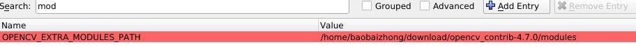
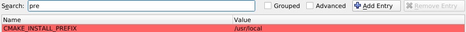
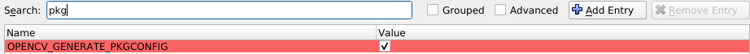
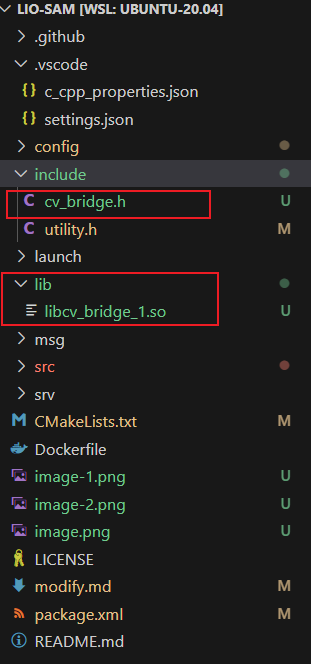

# chanes
1. mapSemantic.cpp      
订阅imageProjection.cpp的去畸变后的点云，以及来自相机的x图像，进行雷达语义提取，并发布cloudInfo, 带语义信息的lidar cloudpoint， 语义分割(目标检查后)的图像      
`lio_sam/semantic/cloudInfo`       
`lio_sam/semantic/img`     
`lio_sam/semantic/cloudPoint`
2. cloud_info.msg       
增加`sensor_msg::PointCloud2 cloud_semantic`        
3. featureExtraction.cpp       
将原来的订阅来自`imgageProjection.cpp`的`cloudInfo`修改为来自`mapsemantic.cpp`的`lio_sam/semantic/cloudInfo`
4. mapoptimization.cpp      
在`publishFrames()`函数中，添加发布坐标变换到全局坐标系下的语义点云。

## wsl配置
1. opencv版本问题，由于ros自带的opencv版本为4.2.0，而使用OpenCV进行YOLOv5/v8的推理，需要4.7.0版本以上的OpenCV，因此装了双版本的OpenCV，同时需要安装cuda以及cudnn，使OpenCV能够使用GPU加速推理       
### 安装cuda与cudn           
[参考1](https://developer.nvidia.com/cuda-toolkit-archive)在这里面找到需要的版本，选择安装系统，架构等内容，安装网站给出的内容安装即可，装好后修改一下`/usr/local/cuda`软链接指向的cuda版本(如果安装了多个版本的cuda，也有可能自带得有一个版本的cuda)
```
rm -rf /usr/local/cuda
sudo ln -s /usr/local/cuda12.0 /usr/local/cuda
```     
再修改一下环境变量，在`~/.bashrc`中，         
```
vim ~/.bashrc
# 在最后添加
export PATH=/usr/local/cuda/bin:$PATH
export LD_LIBRARY_PATH=/usr/local/cuda/lib64:$LD_LIBRARY_PATH
export LIBRARY_PATH=/usr/local/cuda/lib64:$LIBRARY_PATH
```     
记得要放在`&`前面，不然可能无效，现在再使用`nvcc -V`命令查看cuda版本即为刚才安装的版本      
[参考2](https://developer.nvidia.com/rdp/cudnn-download)，在这里面下载cudnn，我下载的`deb`文件，然后使用`sudo dpkg -i` 命令安装即可，[安装教程](https://docs.nvidia.com/deeplearning/cudnn/install-guide/index.html)        
### 安装OpenCV4.7.0：       
如果之前没装过OpenCV，那么直接安装ROS时，会附带安装OpenCV，安装的目录为`/usr`，因此再安装OpenCV4.7.0版本时，默认的安装位置是`/usr/local`(这个位置可以修改，cmake时指定 `CMAKE_INSTALL_PREFIX`路径即可)      
- OpneCV扩展模块    
`OpenCV_contrib`模块，进入[opencv_contrib release](https://github.com/opencv/opencv_contrib/tags)，选择需要的版本下载，然后解压即可。

- 下载OpenCV4.7.0安装包 https://opencv.org/releases/
`OpenCV_contrib`模块，进入[opencv_contrib release](https://github.com/opencv/opencv_contrib/tags)，选择需要的版本下载，然后解压即可
- 解压，进入OpenCV目录      
    ```
    mkdir build && cd build
    cmake-gui ..
    ```
    因为需要利用网络推理，因此记得勾选cuda的相关选项(但不要勾选`BUILD_CUDA_STUBS`)      
    设置OpenCV扩展模块路径
    
    设置安装路径
    
    另外可以设置pkg选项，生成`.pc`文件
    
- 然后configure，generate生成即可
- 解决 `make & sudo make install`即可       
    
### cv_bridge冲突问题
安装ros是会自动安装cv_bridge，但这个cv_bridge只有ros默认安装的opencv版本(4.2.0)适配，而现在使用的OpenCV版本是4.7.0，直接使用cv_bridge，会使用4.2.0相关的库，导致编译失败，因此需要安装另一个cv_bridge   
[参考](https://blog.csdn.net/qq_42257666/article/details/131450279?spm=1001.2014.3001.5506)     [github源码](https://github.com/ros-perception/vision_opencv/tree/noetic)     
进入GitHub，git指定(对应版本)分支的vision_opencv，将其放在workspace的src目录下(~/catkin_ws/src)，进入cv_bridge文件夹，修改`package.xml`与`CMakeLists.txt`文件
```
# package.xml中修改包名称
 <name>cv_bridge</name>  -->  <name>cv_bridge_1</name>
```
```
# CMakeLists.txt中修改工程名称并指定OpenCV版本
project(cv_bridge)   -->   project(cv_bridge_1) 

find_package(OpenCV 4.7.0 REQUIRED
  COMPONENTS
    opencv_core
    opencv_imgproc
    opencv_imgcodecs
  CONFIG
)
```
然后`catkin_make`编译`cv_bridge_1`包，在`devel/`文件夹中找到对应的头文件与so动态链接库，将他们复制到该工作目录下        
        
修改本工程中的`package.xml`与`CMakeLists.txt`，参考上面的参考
